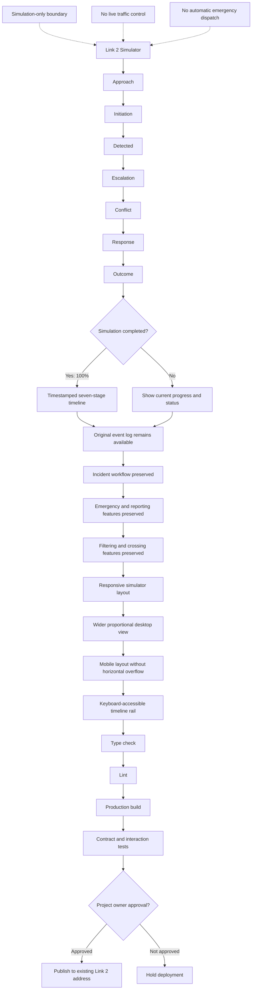

# Architecture

## Overview
Lintas AI Link 2 – Seven-Stage Event Timeline Upgrade is a full application. An enhanced smart-crossing simulator that visualises every incident through a seven-stage, timestamped timeline while preserving Link 2’s existing safety, reporting, and simulation features.

Data contracts live in `data-model.md`; do not persist, parse, expose, or output data shapes that are not documented there.

## Stack Summary

| Layer | Choice |
| --- | --- |
| Frontend | Next.js App Router + TypeScript, Tailwind CSS, shadcn/ui |
| Backend / API | Node.js + Express |
| Database | PostgreSQL |
| ORM / DB Access | Prisma |
| Auth | Local demonstration access gate with signed HTTP-only cookie |
| Validation | Zod |
| Testing | Vitest, Playwright |
| Deployment | Vercel |
| Automation / Scripts | Node.js script, GitHub Actions, Serverless function |

## Architecture Evidence & Diagrams



System boundaries: everything in this repository is inside the boundary; the user's browser, third-party services, and deployment platform are outside. Confirm before adding any integration that crosses it.

### Codebase Graph (optional tool, enabled)
Once code exists, generate a dependency map and summarize it here:

- `npx madge --image graph.svg src/` or `npx dependency-cruiser src` (or Graphify — https://graphify.net)
- Use it to verify module boundaries before refactors or when entering an unfamiliar area.
- Do not regenerate it on every change, and never paste raw graph output into context — summarize.

## Data Flow
1. User interacts with the UI layer.
2. Requests are validated using Zod.
3. MVP feature flow: 1. Smart Pedestrian and Vehicle Detection → 2. Intelligent Traffic-Light Response → 3. Incident Timeline and Emergency Alerts.
4. Persistence is handled by PostgreSQL via Prisma.
5. Results are returned and rendered.

## Folder Structure Recommendation

```text
app/              # routes and pages
components/       # reusable UI components
  ui/             # design-system primitives
lib/              # pure logic, generation, utilities
public/           # static assets
tests/            # unit and e2e tests
```

## Key Implementation Notes
- Authentication approach: fixed local demonstration credentials are validated server-side; an HMAC-signed HTTP-only SameSite=Lax cookie expires after eight hours. This is not production identity management.
- Validation approach: validate all external input at the boundary with Zod.
- Constraint: Modify Link 2 only
- Constraint: Use Link 4 only as the timeline reference
- Constraint: Preserve all existing Link 2 features
- Constraint: Do not replace or remove the original event log
- Constraint: Maintain deterministic simulation behaviour
- Constraint: Keep all operations within simulation-only boundaries
- Constraint: Do not connect to or control live traffic infrastructure
- Constraint: Do not automatically contact real emergency services
- Constraint: Display all seven timeline stages in the required order
- Constraint: Generate a timestamp for every timeline stage
- Constraint: Show 100% completion only after all seven stages finish
- Constraint: Preserve existing incident and emergency workflows
- Constraint: Preserve existing reporting, filtering, and crossing features
- Constraint: Maintain all current safety rules and invariants
- Constraint: Use available desktop width proportionally
- Constraint: Prevent horizontal page overflow on narrow screens
- Constraint: Maintain responsive mobile behaviour
- Constraint: Make the mobile timeline keyboard accessible
- Constraint: Use AIM methodology and Bloom’s taxonomy
- Constraint: Run automated validation on the changed simulator flow
- Constraint: Separate new issues from pre-existing test behaviour
- Constraint: Do not publish without the project owner’s approval
- Constraint: Deploy only to the existing Link 2 address

## Configuration

| Name | Required | Source | Default | Visibility | Used By | Notes |
| --- | --- | --- | --- | --- | --- | --- |
| NEXT_PUBLIC_APP_NAME | Yes | Application configuration | Lintas AI Ampang Jaya | internal | Frontend header, browser title, dashboard branding | Public application name; contains no secret information. |
| DEMO_ACCESS_ID | Yes | `.env.local` or deployment environment | none | secret | `/api/login` | Server-only demonstration ID; never expose through `NEXT_PUBLIC_`. |
| DEMO_ACCESS_PASSWORD | Yes | `.env.local` or deployment environment | none | secret | `/api/login`, session signing | Server-only demonstration password; replace with managed authentication before production. |

Rules:
- Read configuration only from the sources listed here.
- Treat every value marked secret as sensitive: never commit, print, or expose it.
- Update this table before adding a new environment variable, config file key, flag, tfvar, or scheduler setting.

Additional notes: Use TypeScript, Next.js, React, Tailwind CSS, and responsive desktop/mobile layouts. The MVP must run in simulation-only mode using local mock data. Do not require live CCTV, IoT sensors, cloud APIs, MPAJ systems, emergency services, or physical traffic lights. Keep secrets in environment variables and never expose them in frontend code. Use PostgreSQL and Prisma only when persistent storage is required. Deploy the prototype to Vercel after local testing and safety validation.

## Security Considerations

### Peak-hour simulation configuration

Browser-only `HeavyTrafficConfig` is validated by Zod at start. Defaults and presets live in `lib/heavy-traffic.ts`; no environment variables or live integrations are added. One simulation second equals one wall-clock second during playback. Timing defaults are provisional: green 8-20 s, amber 3 s, all-red 2 s, WALK 15 s, pedestrian clearance 3 s, maximum ordinary request wait 40 s. WAIT visibly reaches zero before a separately labelled amber/all-red safety transition; WALK then starts a new full countdown at 15 and reaches zero before clearance. Crossing occupancy and emergency/critical holds override release; unmet waiting limits under these holds are explicitly audited. Queues beyond the 40 m immediate monitoring area are simulated upstream estimates. One controller drives both signal heads, road actors, countdowns, timeline, audit evidence and PDF export. Existing violation/emergency flows remain independent selectable sequences.
- Escape/encode all user-supplied content rendered in the UI (XSS).
- Decide the authentication story before building protected features; enforce authorization on the server, never only in the UI.
- If sessions are introduced, use HTTPS-only cookies and standard session hardening.
- Never commit secrets; load them from the environment or a secrets manager.
- Keep dependencies pinned; update them deliberately, not implicitly.

## Deployment & Operations
- Target: Vercel
- Configuration via the Configuration table; never hardcode environment differences.
- The production build must pass locally before deploying.
- Use preview deployments for review when the platform supports them.
- Rollback: document how to restore the last known-good deployment.

## Known Issues / Tech Debt

| Item | Impact | Planned Resolution |
| --- | --- | --- |
| _None recorded yet_ | _—_ | _Update this table during implementation._ |
