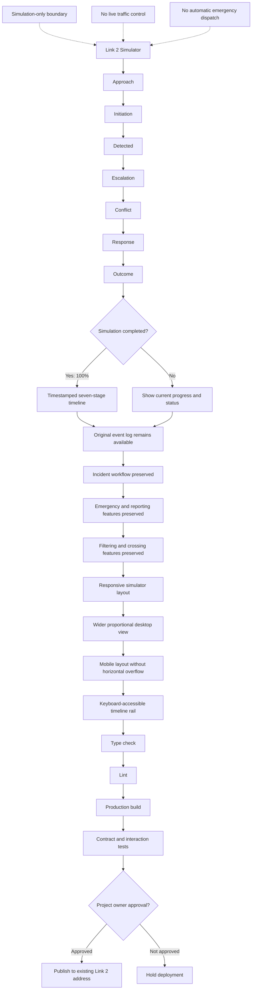

# Build Plan

## Build Objective
An enhanced smart-crossing simulator that visualises every incident through a seven-stage, timestamped timeline while preserving Link 2’s existing safety, reporting, and simulation features.

## Context Preparation (Before Coding)
- [ ] Read the minimum required files per the Context Usage Strategy in `project-overview.md`
- [ ] Validate the architecture diagram with Mermaid CLI before relying on it
- [ ] Generate or inspect the codebase graph report if module boundaries are unclear
- [ ] Confirm open decisions listed in `project-overview.md` or ask before proceeding

## Flow

## MVP Features
- Smart Pedestrian and Vehicle Detection — The simulator detects pedestrians, vehicles, motorcycles, and traffic violations at normal and school crossings.
- Intelligent Traffic-Light Response — The traffic signal changes according to pedestrian demand, vehicle movement, crossing status, and detected risks.
- Incident Timeline and Emergency Alerts — The system records Approach, Initiation, Detected, Escalation, Conflict, Response, and Outcome stages and alerts MPAJ or first responders during life-threatening incidents.

## Implementation Phases

### Phase 0: Project Setup
- [ ] Scaffold the folder structure from `architecture.md`
- [ ] Install approved dependencies from `library-docs.md`
- [ ] Confirm `data-model.md` (entity contracts) or explicitly defer with a tracker decision
- [ ] Confirm `architecture.md` -> `Configuration` or explicitly defer with a tracker decision

- [ ] Configure lint, typecheck, and test tooling so every verification command runs
- [ ] Commit a walking skeleton: the project runs end-to-end with no real features yet

### Phase 1: Smart Pedestrian and Vehicle Detection
_The simulator detects pedestrians, vehicles, motorcycles, and traffic violations at normal and school crossings._

- [ ] Implement
- [ ] Validate inputs
- [ ] Test
- [ ] Verify against definition of done
- [ ] Update `progress-tracker.md`

### Phase 2: Intelligent Traffic-Light Response
_The traffic signal changes according to pedestrian demand, vehicle movement, crossing status, and detected risks._

- [ ] Implement
- [ ] Validate inputs
- [ ] Test
- [ ] Verify against definition of done
- [ ] Update `progress-tracker.md`

### Phase 3: Incident Timeline and Emergency Alerts
_The system records Approach, Initiation, Detected, Escalation, Conflict, Response, and Outcome stages and alerts MPAJ or first responders during life-threatening incidents._

- [ ] Implement
- [ ] Validate inputs
- [ ] Test
- [ ] Verify against definition of done
- [ ] Update `progress-tracker.md`

### Phase 4: Hardening & Release Readiness
- [ ] Review against Security Considerations in `architecture.md`
- [ ] Complete the Testing Checklist below
- [ ] Update docs: README, usage/runbook
- [ ] Final pass on `progress-tracker.md`: statuses, decision log, change log

## Acceptance Criteria
- [ ] The MVP is successful when every completed simulation produces seven correctly ordered, timestamped timeline stages and displays 100% completion; the original event log and all incident, emergency, reporting, filtering, and crossing functions remain operational; the desktop simulator uses available width proportionally; mobile screens display without page overflow; the timeline rail supports keyboard navigation; type checking, linting, production builds, contract tests, and focused desktop/mobile interaction tests pass for the updated flow; and deployment to the existing Link 2 address occurs only after the project owner’s approval.

Definition of done: The Lintas AI Ampang Jaya simulator runs locally without errors and delivers the complete MVP. It supports normal and school crossing scenarios, moving vehicles and pedestrians, traffic-violation simulation, intelligent signal responses, incident alerts, and the seven-stage event timeline: Approach, Initiation, Detected, Escalation, Conflict, Response, and Outcome. All pages are responsive, accessible, readable, and consistent with the approved design system. Simulation-only boundaries and safety disclaimers are visible. Code passes linting, type checking, unit tests, browser tests, and the production build.

## Testing Checklist
- [ ] Smart Pedestrian and Vehicle Detection — happy path and failure path covered
- [ ] Intelligent Traffic-Light Response — happy path and failure path covered
- [ ] Incident Timeline and Emergency Alerts — happy path and failure path covered
- [ ] `npm run lint` passes
- [ ] `npm run typecheck` passes
- [ ] `npm run test` passes
- [ ] `npm run build` passes
- [ ] `npx playwright test` passes

## Risks & Mitigations

| Risk | Likelihood | Mitigation |
| --- | --- | --- |
| Simulation results may not represent real-world traffic conditions | _TBD_ | validate with field data before operational use. |
| Camera or sensor data may produce false detections | _TBD_ | include manual review and confidence thresholds. |
| Traffic violations may be classified incorrectly | _TBD_ | label results as simulation outputs only. |
| Emergency alerts may be delayed or inaccurate | _TBD_ | require human confirmation before dispatch. |
| Heavy rain, poor lighting, and occlusion may reduce detection accuracy | _TBD_ | test adverse conditions separately. |
| System performance may decrease with many simultaneous vehicles and pedestrians | _TBD_ | apply load testing and monitoring. |
| The prototype is not connected to live MPAJ infrastructure | _TBD_ | clearly display simulation-only boundaries. |
| Location and traffic data may be incomplete or outdated | _TBD_ | identify data sources and update dates. |
| Incorrect signal logic could create safety risks | _TBD_ | conduct safety review before any real-world deployment. |
