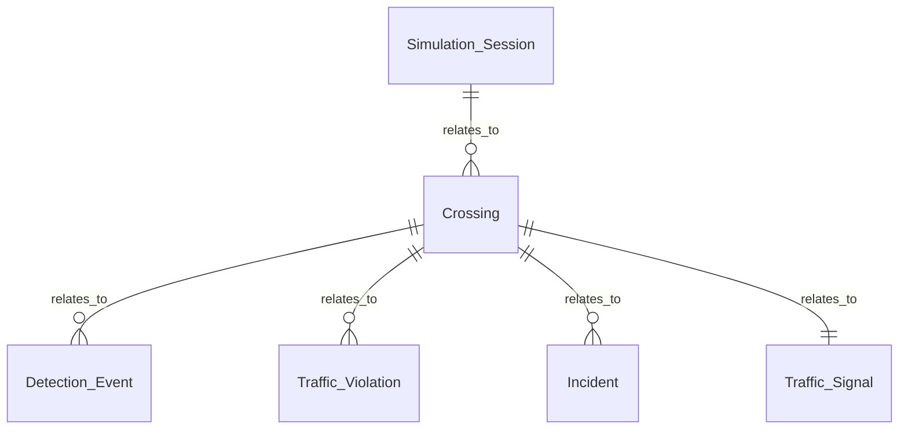

# Data Model

## Entities

### Crossing

A normal or school pedestrian crossing in Ampang Jaya monitored by the smart traffic simulator.

| Field | Type | Required | Notes |
| --- | --- | --- | --- |
| crossing_id | text | Yes | Unique crossing identifier |

### Simulation Input

Validated, non-persisted input selected by the local operator.

| Field | Type | Required | Notes |
| --- | --- | --- | --- |
| mode | `normal \| school` | Yes | Four-way junctions are excluded |
| scenario_id | scenario enum | Yes | Must support the selected mode |
| operating_conditions | object | Yes | Local deterministic weather, lighting, sensor-health and drainage test settings |

### Operating Conditions

| Field | Type | Required | Notes |
| --- | --- | --- | --- |
| weather | `dry \| rain` | Yes | Visual test context only; not a live weather feed |
| lighting | `day \| night` | Yes | Visual test context only |
| sensor_health | `operational \| degraded` | Yes | Adjusts mock confidence; degraded never implies a verified hardware fault |
| drainage | `clear \| ponding` | Yes | Represents a local drainage observation for simulation review |

### Detection Event

Deterministic simulated object detection attached to one session.

| Field | Type | Required | Notes |
| --- | --- | --- | --- |
| detection | text | Yes | Local scenario description |
| confidence | number | Yes | Mock score from 0 to 1; not an AI result |
| vehicle_count | integer | Yes | Simulated count |
| pedestrian_count | integer | Yes | Simulated count |
| motorcycle_count | integer | Yes | Simulated count |

### Traffic Signal

| Field | Type | Required | Notes |
| --- | --- | --- | --- |
| vehicle | `GO \| AMBER \| STOP` | Yes | WALK requires STOP |
| pedestrian | `WAIT \| WALK` | Yes | Never WALK during a vehicle conflict |
| action | text | Yes | Deterministic controller action |
| reason | text | Yes | Plain-language explanation |

### Camera-Degradation Fallback

A local simulation-only branch activates below 75% combined camera-health quality. A button press latches demand but never commands WALK. The controller requires agreement from simulated radar, LiDAR, stop-line, vehicle-presence, and controller-state inputs before a fixed 15-second protected interval; disagreement produces Safety Hold. The request clears after pedestrian clearance, while degraded mode remains active until camera recovery.

### Timeline Stage

| Field | Type | Required | Notes |
| --- | --- | --- | --- |
| name | seven-stage enum | Yes | Approach through Outcome, ordered |
| timestamp | ISO datetime | Yes | Generated for every stage |
| detail | text | Yes | Simulation trace explanation |
| status | `complete` | Yes | Seven stages means 100% completion |

### Incident and Event Log

Critical simulations create a local incident requiring human confirmation. Event log entries contain an identifier, ISO timestamp, category, and message. Neither entity triggers external dispatch or persistence.

### Classification and Evidence

- Every violation has a stable category, severity and plain-language severity rationale. Only simulated collision and fire outcomes are `critical` incidents.
- The condition-adjusted detection confidence is derived deterministically from the scenario confidence and operating conditions.
- ANPR remains inactive for no-violation runs. For a violation, synthetic evidence activates at the `Detected` stage only and never queries a live vehicle database.
- Notification recipients exist only as contextual local mock-queue records for critical collision or fire scenarios. No external message is transmitted.

### Peak-Hour Heavy Traffic (browser memory only)

`HeavyTrafficConfig` stores directional peak arrivals (vehicles/minute), pedestrian interval, initial queue, sensor health (`operational`, `redundant`, `failed`), optional emergency direction/time, persistence/cooldown periods, queue thresholds and bounded green/amber/all-red/walk/clearance/wait timings. Zod validates configuration and timing relationships before start.

`HeavyTrafficState` records simulation time, mode, signal phase, independent direction metrics, persistent vehicle IDs/positions/speeds, latched pedestrian demand, crossing occupancy, emergency record, seven-stage observations and audit entries. Audit entries include timestamp, direction, evidence, action, safety rule and result. Queue length includes an explicitly estimated upstream portion beyond the 40 m immediate monitoring area. All inputs and confidence are simulated. Summary records initial/maximum/final queue, processed vehicles, delay, pedestrian service, emergency events, holds, violations and stabilisation time. No field measurements or persistence are introduced.

## Relationships
- Crossing has many Detection Event
- Crossing has many Traffic Violation
- Crossing has many Incident
- Crossing has one Traffic Signal
- Simulation Session has many Crossing
- Incident belongs to one Crossing

## ER Diagram

## Data Rules
- Validate all external input at the boundary with Zod.
- Do not invent schemas, payloads, variables, outputs, config shapes, or persisted state.
- Update this file before changing a schema or data contract.
- Record schema decisions in the Decision Log of `progress-tracker.md`.

## Notes
This is a simulation-only data model for normal and school pedestrian crossings in Ampang Jaya. Exclude four-way junction scenarios. Do not connect automatically to live MPAJ infrastructure, emergency services, CCTV, or physical traffic lights.

MVP state is intentionally held in browser memory. PostgreSQL and Prisma are deferred because persistent storage is not required by the local simulation flow.
